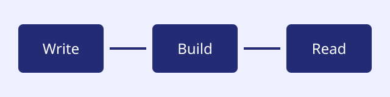

Welcome to **Starlyt Docs**, a documentation site built from ordinary Markdown. Read the [long guide](./guides/long-guide/) or explore the [code examples](./reference/code-examples/).

## Getting started

Choose a topic in the sidebar. This overview uses *emphasis*, **strong text**, and literal inline code such as `<article>`.

- Install the theme.
- Configure ordered navigation.
- Write Markdown and publish your site.

## Documentation workflow

1. Make a small, reviewable change.
2. Build the site locally.
3. Check the rendered result before publishing.

> Good documentation explains what a reader can do, not just how the software is arranged.

### Using `config.json`

Configuration is ordinary data. Keep the content separate from the theme.

## A small diagram

## Printable interactive content

The [external print destination](https://example.test/print-target?mode=complete)
prints its URL. [Internal navigation](./guides/long-guide/), the
[page fragment](#getting-started), [email](mailto:docs@example.test), and
[telephone](tel:+15550123) links do not add destination suffixes.

The first printable tab panel remains visible.
The hidden printable tab panel is also complete.




